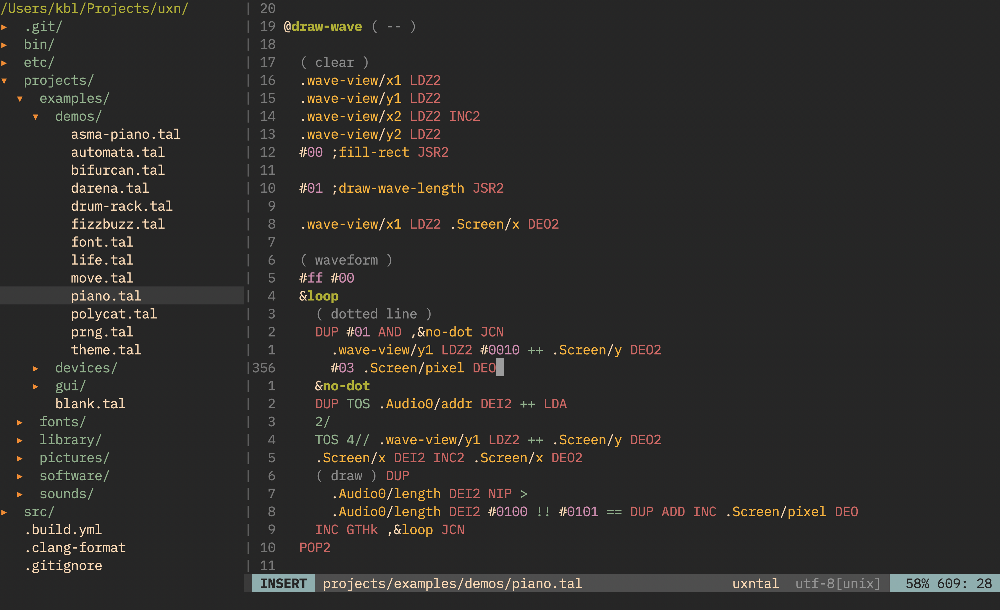

# uxntal.vim

File detection and syntax highlighting for the [Uxntal](https://wiki.xxiivv.com/site/uxntal.html) programming language.

## Preview



_Theme: Gruvbox Dark_

## Installing

Use your package manager of choice. If you don't know where to start, you can install this plugin with Vim's built-in package manager by just cloning this repository to somewhere in `~/.vim/`:

```console
git clone https://github.com/karolbelina/uxntal.vim.git ~/.vim/pack/plugins/start/uxntal.vim
```

Make sure that the following options are set in your `~/.vimrc` so that all features are enabled:

```vim
syntax on
filetype plugin indent on
```

## Testing

To run the whole test suite run

```console
scripts/test.sh tests/*.tal
```

or provide the path to an individual test case.

To bless a test case, pass in a `--bless` flag:

```console
scripts/test.sh tests/hello-world.tal --bless
```

Under the hood, the custom `test.sh` script uses `vim` to export test cases as HTML files with a bunch of `<span>` tags, which are then transformed to a format inspired by [vscode-tmgrammar-test](https://github.com/PanAeon/vscode-tmgrammar-test) and [Sublime Text syntax tests](https://www.sublimetext.com/docs/3/syntax.html#testing). These files are then compared to `.snap` files in the [`tests`](tests) directory.

## License

This software is licensed under the MIT license.

See the [LICENSE](LICENSE) file for more details.
